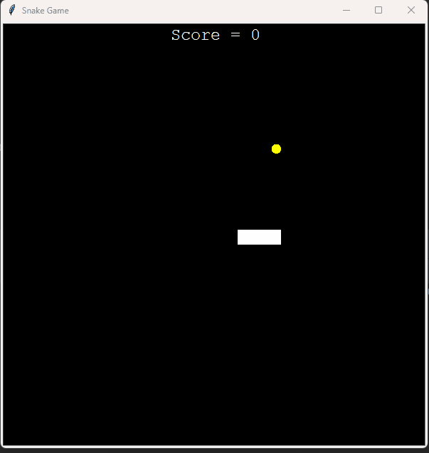
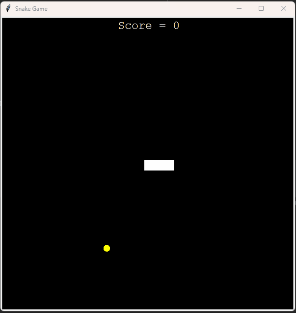

# 🐍 Snake Game — Python Turtle Graphics

A classic Snake game built using Python’s built-in **turtle graphics** module.  
The game features dynamic snake growth, collision detection, food spawning, and live score tracking.

---

## 🎮 Demo



⬆️*Game over due to wall collision*⬆️




⬆️*Game over due to self collision*⬆️

---

## 📌 Overview

This project recreates the classic Snake arcade game using object-oriented Python.  
The program is structured into multiple modules for clean separation of logic:

- Snake movement and growth
- Random food spawning
- Score tracking
- Collision detection (wall + self)

---

## ⚙️ Features

- Real-time keyboard controls
- Snake grows when food is eaten
- Random food placement
- Scoreboard display
- Wall collision detection
- Self-collision detection
- Game over screen
- Modular OOP design

---

## 🧱 Project Architecture
```
📁 snake-game/
├── 🗂️ assets/
│ ├── 🎬 snake-demo.gif
│ └── 🎬 snake-demo2.gif
│
├── 🐍 main.py # Game loop and event handling
├── 🐍 snake.py # Snake class: movement, growth, direction control
├── 🐍 food.py # Food class: random spawn and refresh logic
├── 🐍 scoreboard.py # Score tracking and game-over display
└── 📄 README.md
```

## 🧩 How It Works

### Snake (`snake.py`)
- Creates starting body segments
- Moves by shifting segment positions
- Prevents reverse direction
- Extends body when food is eaten

### Food (`food.py`)
- Generates food at random coordinates
- Refreshes location after each collision

### Scoreboard (`scoreboard.py`)
- Displays current score
- Updates score on food collision
- Shows game over message

### Main Loop (`main.py`)
- Handles screen updates
- Detects collisions
- Controls game state

---

## 🚀 Installation & Run

### Requirements
- Python 3.x
- turtle module (included with Python)

### Run the Game

```bash
git clone https://github.com/rohitb281/snake-game.git
cd snake-game
python main.py
```

## 🎮 Controls
| Key         | Action     |
|--------------|-------------|
| Up Arrow     | Move Up     |
| Down Arrow   | Move Down   |
| Left Arrow   | Move Left   |
| Right Arrow  | Move Right  |

## 🧠 Concepts Demonstrated
- Object-Oriented Programming
- Event handling
- Game loop design
- Collision detection
- State management
- Modular code architecture

---

## 📈 Possible Improvements
- High score persistence
- Difficulty levels
- Pause/resume feature
- Sound effects
- Restart without closing window
- Adjustable speed

---

## 🧪 Known Limitations
- No restart button after game over
- Fixed movement speed
- No boundary wrapping

---

## 📄 License

Open for educational and portfolio use.

---

## 👤 Author

Rohit Bollapragada

GitHub: https://github.com/rohitb281
